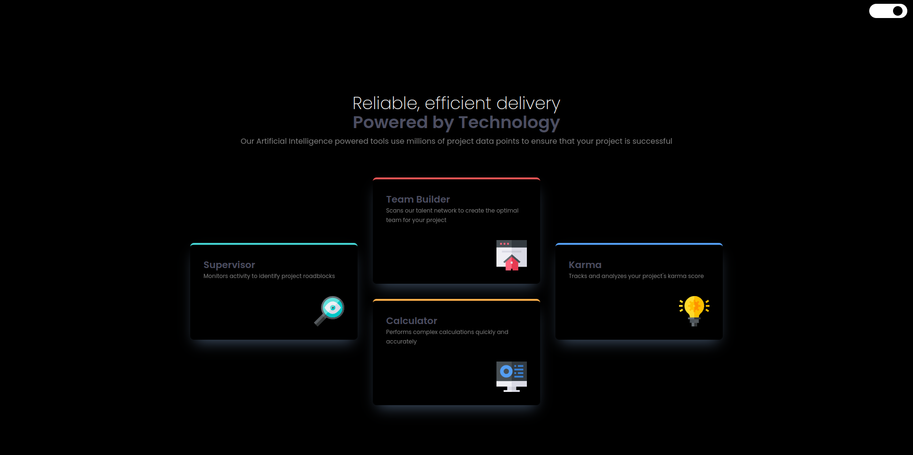

# Frontend Mentor - Four card feature section solution

This is a solution to the [Four card feature section challenge on Frontend Mentor](https://www.frontendmentor.io/challenges/four-card-feature-section-weK1eFYK). Frontend Mentor challenges help you improve your coding skills by building realistic projects.

## Table of contents

- [The challenge](#the-challenge)
- [Screenshot](#screenshot)
- [Links](#links)
- [My process](#my-process)

### The challenge

Your users should be able to:

- View the optimal layout for the site depending on their device's screen size

### Screenshot





### Links

- Solution URL: https://github.com/Genildocs/fourCard
- Live Site URL: https://four-card-lyart-eight.vercel.app/

## My process

### Built with

- Semantic HTML5 markup
- CSS custom properties
- Flexbox
- CSS Grid
- [React](https://reactjs.org/) - JS library
- [Vite.js](https://vitejs.dev/) - React framework
- [Tailwind](https://tailwindui.com/) - For styles
- [Framer Motion.](https://www.framer.com/motion/) - For styles

### What I learned

- useMediaQuery

```
const isLargeScreen = useMediaQuery({ query: '(min-width: 1024px)' });
```

- Frame motion

```
const spring = {
    type: 'spring',
    stiffness: 700,
    damping: 30,
  };

  return (
    <div className="flex justify-end pt-2 pr-3">
      <div
        className={`${
          theme === 'light'
            ? 'justify-start bg-black'
            : 'justify-end bg-slate-300'
        } switch`}
        onClick={toggleTheme}
      >
        <motion.div className="handle" layout transition={spring} />
      </div>
    </div>
```

- useContext

```
import React, { createContext, useState, useEffect } from 'react';
```

- Local Storage

```
const storedTheme = localStorage.getItem('theme');

useEffect(() => {
    localStorage.setItem('theme', theme);
  }, [theme]);

```

## Author

- GitHub - https://github.com/Genildocs
- Linkedin - https://www.linkedin.com/in/genildo-cerqueira-91888786/
